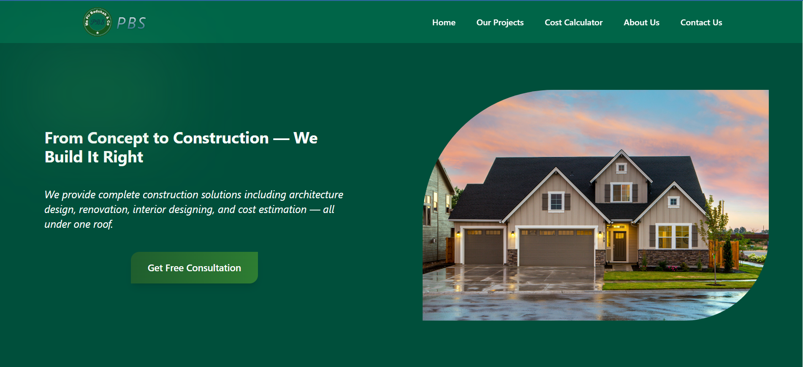
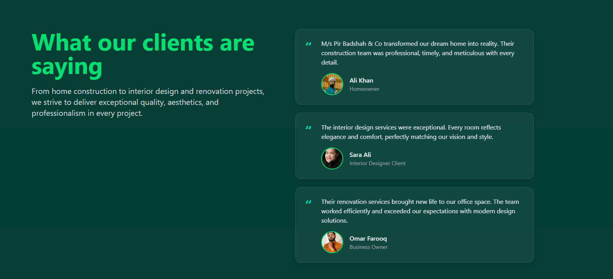
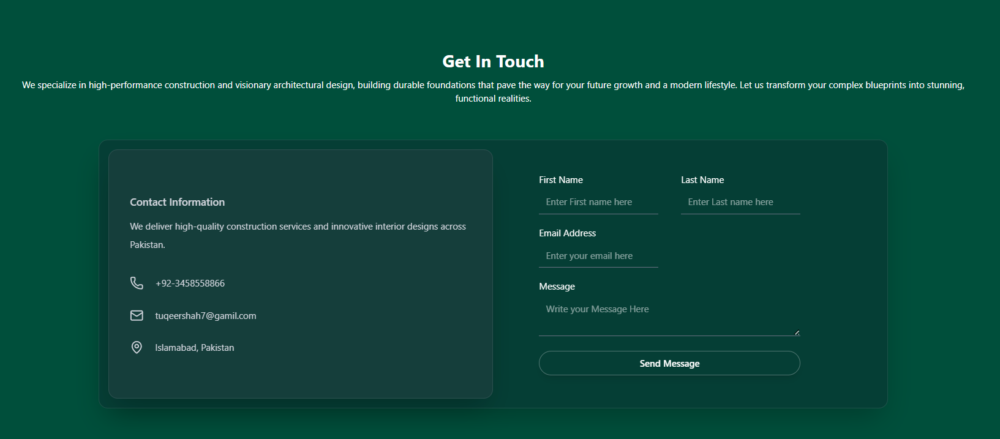

# 🏗️ Construction Company Website

A modern, responsive construction company website built using **React** and **Tailwind CSS**. The website highlights professional construction services including architecture design, renovation, interior design, and client testimonials with a clean and elegant user interface.

---

## 🚀 Features

- Modern Hero Section with call-to-action
- About Us section describing company vision & expertise
- Services section:
  - Construction Services
  - Architecture Designing
  - Renovation Services
  - Interior Designing
- Client Testimonials section
- Contact Us form with user input handling
- Fully responsive design for all screen sizes
- Clean UI with smooth hover animations

---

## 🛠️ Tech Stack

- **React (Vite)**
- **Tailwind CSS**
- **JavaScript (ES6+)**
- **Lucide Icons**
- **Responsive Layout**

## 📸 Screenshots

# React + Vite

This template provides a minimal setup to get React working in Vite with HMR and some ESLint rules.

Currently, two official plugins are available:

- [@vitejs/plugin-react](https://github.com/vitejs/vite-plugin-react/blob/main/packages/plugin-react) uses [Babel](https://babeljs.io/) (or [oxc](https://oxc.rs) when used in [rolldown-vite](https://vite.dev/guide/rolldown)) for Fast Refresh
- [@vitejs/plugin-react-swc](https://github.com/vitejs/vite-plugin-react/blob/main/packages/plugin-react-swc) uses [SWC](https://swc.rs/) for Fast Refresh

## React Compiler

The React Compiler is not enabled on this template because of its impact on dev & build performances. To add it, see [this documentation](https://react.dev/learn/react-compiler/installation).

## Expanding the ESLint configuration

If you are developing a production application, we recommend using TypeScript with type-aware lint rules enabled. Check out the [TS template](https://github.com/vitejs/vite/tree/main/packages/create-vite/template-react-ts) for information on how to integrate TypeScript and [`typescript-eslint`](https://typescript-eslint.io) in your project.
